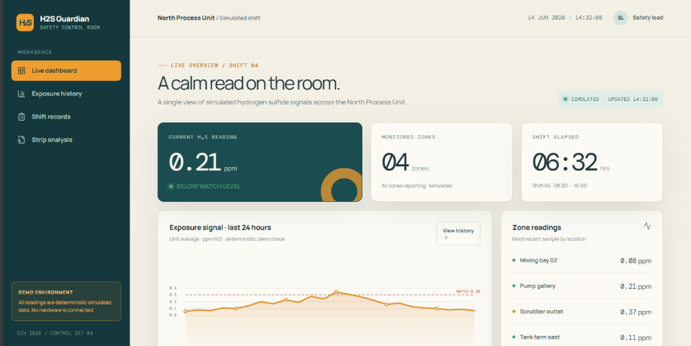
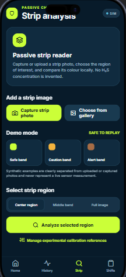

# H2S Safety Guardian 🛡️

A comprehensive industrial safety monitoring and visual colorimetric analysis platform designed to protect personnel from Hydrogen Sulfide ($\text{H}_2\text{S}$) hazards in high-risk environments (petrochemical facilities, wastewater treatment, oil & gas drilling, and confined spaces).

---

## 📸 Prototype Preview

> [!NOTE]
> **Prototype Demonstration:** The interfaces shown below represent an early-stage working prototype demonstrating the user experience, real-time safety telemetry, and computer-vision colorimetric test strip analysis. This is **not the final production release**; field-sensor hardware integration and production calibration curves are actively under iterative development.

| Web Dashboard (Safety Control Room) | Mobile Field App (Colorimetric Strip Analysis) |
| :---: | :---: |
|  |  |
| *Facility-wide live telemetry, multi-zone PPM tracking & 24-hr exposure signals* | *Field chemical indicator strip reader with ROI selection & tone matching* |

---

## 🌟 Key Features

### 1. 📱 Field Mobile Application (`artifacts/h2s-guardian-mobile`)
- **Real-Time Monitoring:** Instantaneous gas concentration alerts (PPM) and safety threshold triggers (Good, Amber, Hazard).
- **Computer-Vision Colorimetric Badge Analysis:** High-accuracy camera capture and image processing of chemical indicator strips/badges:
  - Configurable Region of Interest (ROI): Full, Center, Middle-Band.
  - RGB & HSV color-space decomposition.
  - Nearest-calibration matching and tone delta algorithms.
- **Exposure & Dosimetry Tracker:** Tracks cumulative worker exposure, Time-Weighted Average (TWA), and Short-Term Exposure Limits (STEL).
- **Shift & Safety Checklists:** Digital pre-shift checklists, safety inspections, and incident logging.
- **Sensor & Tone Calibration:** Dynamic calibration curves for field sensors and visual badge batches.

### 2. 💻 Web Monitoring Dashboard (`artifacts/h2s-guardian-web`)
- **Facility-Wide Telemetry:** Multi-station live telemetry (Pump Gallery, Scrubber Outlets, Mixing Bays, Tank Farms).
- **Centralized Strip Analysis Lab:** Upload inspection photos, adjust detection zones, review dominant color spectrums, and verify exposure history.
- **Shift & Incident Audits:** Complete audit trails of worker shifts, gas alarms, and inspection logs.
- **Export & Reporting:** Export safety metrics and visual reports for compliance and OSHA/regulatory records.

### 3. ⚙️ Backend & Shared Packages
- **`artifacts/api-server`**: Express 5 REST API powering telemetry, records, and calibration data.
- **`lib/db`**: PostgreSQL schema with Drizzle ORM.
- **`lib/api-spec`**: OpenAPI 3.0 specification for API contracts.
- **`lib/api-zod`**: Strongly-typed Zod schemas generated from OpenAPI contracts.
- **`lib/api-client-react`**: React Query hooks generated via Orval for client apps.

---

## 🏗️ Repository Architecture

```
H2S-Safety-Guardian/
├── artifacts/
│   ├── api-server/             # Express.js REST API server
│   ├── h2s-guardian-mobile/    # Expo / React Native mobile application
│   ├── h2s-guardian-web/       # React + Vite industrial web dashboard
│   └── mockup-sandbox/         # Prototyping sandbox
├── docs/
│   └── screenshots/            # Prototype screenshots for documentation
├── lib/
│   ├── api-client-react/       # Generated React Query API client
│   ├── api-spec/               # OpenAPI contract definitions
│   ├── api-zod/                # Generated Zod validation schemas
│   └── db/                     # Drizzle ORM schema & migrations
├── package.json                # Root pnpm monorepo configuration
├── pnpm-workspace.yaml         # Workspace definition
└── tsconfig.base.json          # Shared TypeScript settings
```

---

## 🚀 Getting Started

### Prerequisites
- **Node.js**: `>= 20` (Node.js 22 or 24 recommended)
- **pnpm**: `>= 12.8.1` (`corepack enable pnpm` or `npm install -g pnpm`)

### 1. Install Dependencies
```bash
pnpm install
```
*(Dependencies and build artifacts like `node_modules` and `dist` are excluded from version control).*

### 2. Development Commands
You can run services individually or via root workspace commands:

```bash
# Run Web Dashboard (Vite on port 5173 / configured host)
pnpm run dev:web
# (or simply: pnpm run dev)

# Run Mobile App (Expo)
pnpm run dev:mobile

# Run API Server (Express on port 5000)
pnpm run dev:server
```

### 3. Typecheck & Build
```bash
# Typecheck across all workspace packages
pnpm run typecheck

# Build all packages
pnpm run build
```

---

## 🔒 Security & Data Hygiene
- Dependency folders (`node_modules`), caches (`.cache`, `.expo`, `tmp`), build artifacts (`dist`, `*.tsbuildinfo`), and environment variables (`.env*`) are strictly ignored via `.gitignore` to maintain a lightweight and secure repository.

---

## 📜 License
MIT License
